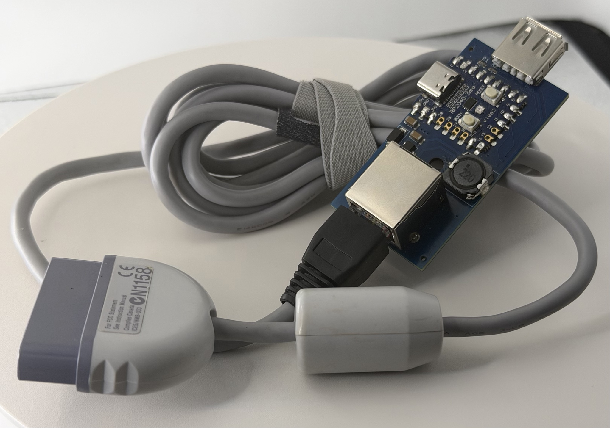

# Remapper PSX Fusion

An AI slop bodged combination of:

## HID Remapper

https://github.com/jfedor2/hid-remapper/

## usb-to-ps1-mouse-pro

https://github.com/Franticware/usb-to-ps1-mouse-pro

## Reasoning

USB-To-PS1-Mouse-Pro is a Pi Pico implementation of the PSX controller spec. It allows a USB mouse to work as a PlayStation mouse on a PSX console.

However, it does not work with non-standard mice, like the Taito Egret Ⅱ Mini Paddle and Trackball controller.

HID Remapper is a great Pi Pico project for converting one type of USB device to another type of USB device.

Originally, I had two RP2040 devices. One ran HID Remapper and one ran USB-To-PS1-Mouse-Pro.

At some point, I realized:

1. The USB-To-PS1-Mouse-Pro project uses one of the RP2040 cores to send PSX signals, and the other core to read the HID data.
2. The HID-Remapper project only uses one of the RP2040 cores, period.

The idea was simple: Replace the HID data reading from the first project with the remapper project.
What was less simple is that I'm definitely not capable of reading and gaining a thorough understanding of either project.

Despite the **incredibly** generous help of jfedor2, I couldn't get a solid handle of the HID Remapper, and beyond adding another build target to build it to Franticware's PSX adapter PCB, I could not get the device timing down, and the mouse movement was jittery and random at best. The project sat untouched for a couple years.

## Slop to the Rescue

A couple days ago I decided to take the dive and seeing if Claude could actually perform the project link that I couldn't figure out for the life of me. Two passes and 10 minutes later, it had a functioning patch. I rsynced it, and it completely failed to build. I removed Claude's CMake modification and restored my own, fixed it to match the constants and defintions that Claude wrote but never set properly, and about an hour later... it worked. Completely.

## PS360+

I also modified Franticware's PCB, which by default ends in a PSX controller connector, and replaced it with an RJ45 connector that was arranged to match the PS360+ pinout: https://filthypants.blogspot.com/2018/12/retro-console-rj45-pinouts-ps360-mc.html

Primary reason for this was that it was way easier to source RJ45 connectors and I had a few chopped off PSX controller cables, courtesy of Free Geek's room at 2DCon a few years ago: https://www.freegeektwincities.org/

The original, failed attempt technically worked fine with this PCB design, I just had to use two of them. One was flashed to the remapper_retro build I added to HID Remapper and the second was flashed to the PS1-Mouse-Pro. With the Claude merged version, I only had to flash the remapper_retro code and the Egret Mini adapter, properly converted into a Mouse, worked perfectly as a mouse on a PSX device.

## Modes

This version has had one major modification made over the original PS1-Mouse-Pro code: **it supports more than mice**.

The HID Remapper device modes present the PSX end as different devices:

- Switch - Presents as a PSX Dual Analog controller.
  - Home button toggles Analog button.
  - LED on device designates analog/digital modes, same as the original
- Stadia - Presents as a PSX NeGCon.
- Keyboard/Mouse - Presents as a PSX Mouse.
