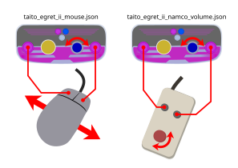

# Example HID Remapper JSON Files

These files can be imported in via Actions -> Import JSON File in the HID Remapper configuration Web-UI

They will work fine as-is, but are primarily designed to work with the PSX conversion

## taito_egret_ii_mouse.json

This is designed to basically turn the Taito Egret Mini Trackball and Paddle controller into a normal computer mouse.

By default, this controller had a really weird configuration. The trackball was a mouse that ran at about 1/8th the expected speed and the spinner knob worked as a mouse scroll wheel. The remap turns both into mouse cursor movement. The trackball now moves 8 times faster and the scroll wheel also moves the mouse on the X axis.

The purple buttons on the left and right function as left and right mouse clicks.

The white button will reverse the knob's x-axis mouse direction, which I thought felt more natural in Tempest X for PS1.

## taito_egret_ii_namco_volume.json

This basically turns the Egret II Mini into a "Namco Volume" controller. Maps the purple left/right buttons as I and II on that controller and the paddle moves the dial left and right. Works in Namco Museum Volume 2 (Japanese release), which supports the Volume Controller but NOT the PlayStation Mouse.

## taito_egret_ii_spin_analog_joystick.json

This is a VERY niche use case.

The "Lords of Lunar" mini game that came with the 4th "Making Of" disc in Lunar: Silver Star Story Complete was designed as a 9-player version of Atari's Warlords.

However, it does not support the Volume Controller OR the PlayStation mouse. The only way to orient your paddle is to point the analog joystick in that direction.

As such, this profile presents an Analog Stick with these toggles:

- White mini button mapped to "Analog Toggle". You'll need this to select your character, as the joystic gets in the way.
- Purple/Blue mini buttons mapped to left and right on the d-pad, respectively
- Left and Right Purple buttons are mapped to Start and Cross, if I remember right.

## yuangeki_gamepad.json

May delete this, as it's not particularly relevant to the project. This converts the Yuancon Yuangeki controller into a standard gamepad, with the angle of the lever converted to the X axis on the joystick, and the rest to face and shoulder buttons/triggers. The left/right d-pad buttons were doubled up into L3/R3 on account of the fact that USB gamepads in Windows have hard-locked axes, making it impossible to press the left and right buttons at the same time.

